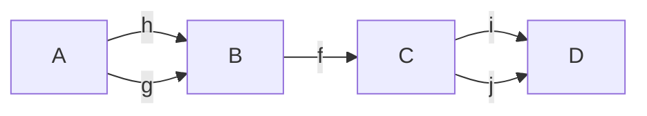
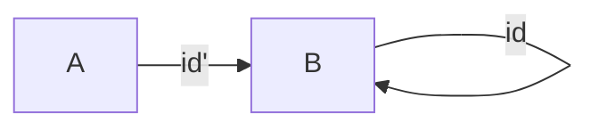

# 1) Considerar los siguientes diagramas.  En ambos casos,  probar que si los dos tri ́angulos conmutan,tambi ́en conmuta el cuadrado.
```
A -> B
| \  |
v    v
C -> D
```

Como los triángulos conmutan:
- AB o BD = AD
- AC o CD = AD

Por lo tanto 
- AB o BD = AC o CD

y el cuadrado conmuta  
```
A -> B
|  / |
v    v
C -> D
```
Como los triángulos conmutan:
- AB o BC = AC
- BC o CD = BD

Entonces

- AB o BD = AB o (BC o CD) = (AB o BC) o CD = AC o CD

# Un conjunto ordenado visto como categoría sin contar identidades
- toda flecha es mono
- toda flecha es epi
- ninguna aes iso

# 2. Sea X un conjunto ordenado. Mostrar que X puede considerarse como una categoría.

$ob(X, <) = X$

$mor(X, <)$ :
- $p \rightarrow q \iff p < q$
- $dom(p \rightarrow q) = p$
- $codom(p \rightarrow q) = q$

Composición:
$p \le q, q \le r \implies p \le r$ por transitividad

Asociatividad ?

# 3. Verificar que un monoide M define una categor ́ıa con un  ́unico objeto cuyas flechas son los elementos de M.

ob C = {*}
mor C = Hom(*, *) = M
- $m_1 \circ m_2 := m_1 m_2$
    - Es asociativa
- $id_* = e$

# 4. 


# 9. Sean C una categor ́ıa y f,g flechas de C.  Probar que


##  a) Si f y g son monomorfismos, entonces g◦f tambi ́en lo es.
f ∈ Hom(B, C) monomorfismo: 
∀A ∈ ob Cat , ∀h_1 , h_2 ∈ Hom(A, B), [f ◦ h_1 = f ◦ h_2 =⇒ h_1 = h_2]

g ∈ Hom(C, D) monomorfismo: 
∀A ∈ ob Cat , ∀h_1 , h_2 ∈ Hom(A, C), [g ◦ h_1 = g ◦ h_2 =⇒ h_1 = h_2]

Para ver que gof es monorfismo, veamos qué 

∀A ∈ ob C , ∀h_1 , h_2 ∈ Hom(A, B), [gof o h_1 = gof ◦ h_2 =⇒ h_1 = h_2]

- $(g \circ f) \circ h_1 = (g\circ f) \circ h_2$
- $\iff$ Asociatividad
- $g \circ (f \circ h_1) = g \circ (f \circ h_2)$
- $\implies$ g mono
- $f \circ h_1 = f \circ h_2$
- $\implies$ f mono
- $h_1 = h_2$


## b) Si g◦f es un monomorfismo, f también lo es.
- $f \circ h_1 = f \circ h_2 $
- $\implies $
- $g \circ (f \circ h_1) = g \circ (f \circ h_2)$
- $\implies$ Asoc
- $(g \circ f) \circ h_1 = (g \circ f) \circ h_2$
- $\implies $ Hip
- $h_1 = h_2$

## c) Si f y g son epimorfismos, entonces g◦f tambi ́en lo es.

- $h_1 \circ (g\circ f) = h_2 \circ (g\circ f)$
- $\iff$ Asoc
- $(h_1 \circ g) \circ f = (h_2 \circ g) \circ f$
- $\implies$ f epi
- $h_1 \circ g = h_2 \circ g$
- $\implies$ g epi
- $h_1 = h_2$

## d) Si g◦f es un epimorfismo, g tambi ́en lo es.
- $h_1 \circ g = h_2 \circ g $
- $\iff $
- $(h_1 \circ g) \circ f = (h_2 \circ g) \circ f$
- $\implies $ Asoc
- $h_1 \circ (g \circ f) = h_2 \circ (g \circ f)$
- $\implies$ Hip
- $h_1 = h_2$

## e) Si f−1 es la inversa de f y g−1 es la inversa de g, entonces f−1◦g−1 es la inversa de g◦f.

A izq
- $(f^{-1} \circ g^{-1}) \circ (g \circ f)$
- $= f^{-1} \circ (g^{-1} \circ g) \circ f$
- $= f^{-1} \circ id \circ f$
- $= f^{-1} \circ f$
- $= id$

A der
- $(g \circ f) \circ (f^{-1} \circ g^{-1})$
- $= g \circ (f \circ f^{-1} ) \circ g^{-1}$
- $= g \circ id \circ g^{-1}$
- $= g \circ g^{-1}$
- $= id$


# 10. Mostrar que una flecha de una categor ́ıa puede ser mono y epimorfismo y no isomorfismo.


No graficamos todas las flechas pero sabemos que:
- Están todas las composiciones
- Están las identidades
- Es asociativo (no afecta)

Por lo cual seguimos teniendo las flechas de izquierda a derecha y ninguna que vuelva desde C hacia B. Por lo tanto no puede existir la inversa de f


# 11. Mostrar que una flecha de una categor ́ıa concreta puede ser epimorfismo y no sobreyectiva.


Tal que $A \sube B$

- $id' \circ id = id' \circ id$
- $id' = id' $

Por lo tanto id' es epi

Y como $A \sube B$, id' no es sobre 


Una subcategoría S de una categoría C está dada por
- una subcolección de objetos de C, ob(S)
- una subcolección de flechas de C, fl(S)
tales que
- $\forall x \in ob(S), 1.x \in fl(S)$
- $\forall f \in fl(S) dom(f), codom(f) \in ob(S)$
- $\forall f,g \in fl(S) \implies f.g \in fl(S) (si está definida)$

Una subcategoría S de una categoría C es completa si para cada x,y \in ob(S)
flS(x,y) = flC(x,y)

Ejemplos
- Set es sugcategoría de Rel (no completa)
- Pos es subcategoría de Pre (completa)
- Gr es subcategoría de Mon (completa)


Práctica 4:
1-14, 16 (tachar producto y coproducto), 25, 26