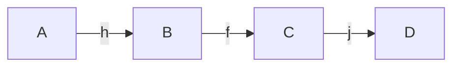
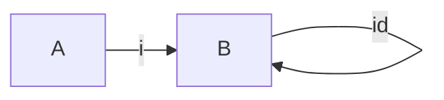
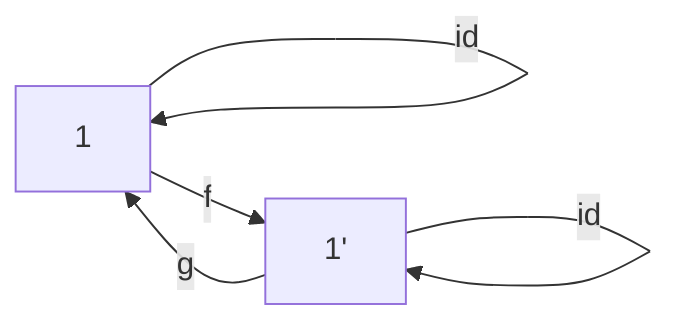
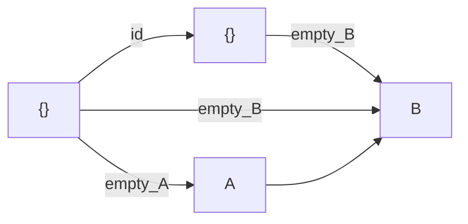
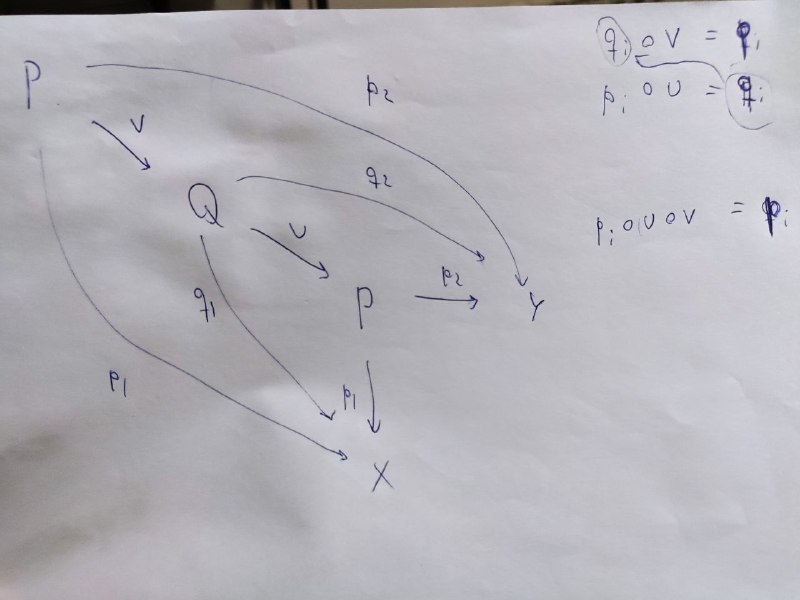
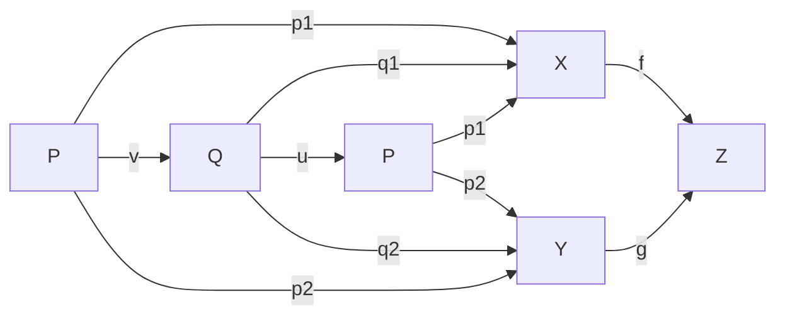
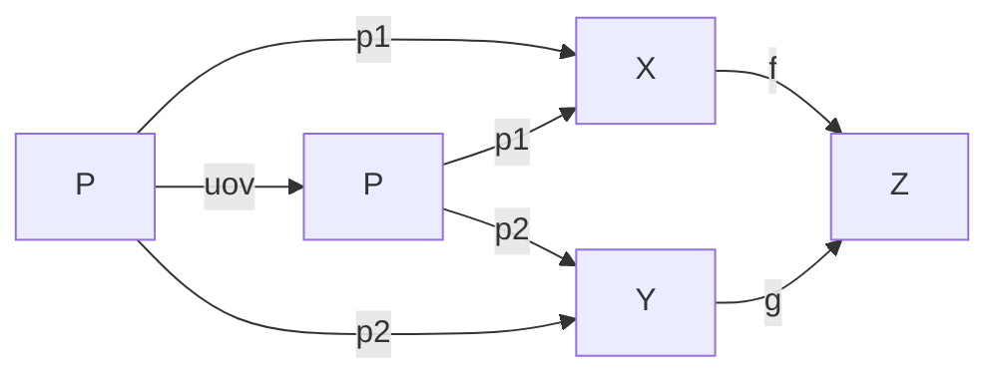

# 1) Considerar los siguientes diagramas.  En ambos casos,  probar que si los dos tri ́angulos conmutan,tambi ́en conmuta el cuadrado.
```
A -> B
| \  |
v    v
C -> D
```

Como los triángulos conmutan:
- AB o BD = AD
- AC o CD = AD

Por lo tanto 
- AB o BD = AC o CD

y el cuadrado conmuta  
```
A -> B
|  / |
v    v
C -> D
```
Como los triángulos conmutan:
- AB o BC = AC
- BC o CD = BD

Entonces

- AB o BD = AB o (BC o CD) = (AB o BC) o CD = AC o CD

# Un conjunto ordenado visto como categoría sin contar identidades
- toda flecha es mono
- toda flecha es epi
- ninguna aes iso

# 2. Sea X un conjunto ordenado. Mostrar que X puede considerarse como una categoría.

$ob(X, <) = X$

$mor(X, <)$ :
- $p \rightarrow q \iff p < q$
- $dom(p \rightarrow q) = p$
- $codom(p \rightarrow q) = q$

Composición:
$p \le q, q \le r \implies p \le r$ por transitividad

Asociatividad ?

# 3. Verificar que un monoide M define una categor ́ıa con un  ́unico objeto cuyas flechas son los elementos de M.

ob C = {*}
mor C = Hom(*, *) = M
- $m_1 \circ m_2 := m_1 m_2$
    - Es asociativa
- $id_* = e$

# 4. 


# 9. Sean C una categor ́ıa y f,g flechas de C.  Probar que


##  a) Si f y g son monomorfismos, entonces g◦f tambi ́en lo es.
f ∈ Hom(B, C) monomorfismo: 
∀A ∈ ob Cat , ∀h_1 , h_2 ∈ Hom(A, B), [f ◦ h_1 = f ◦ h_2 =⇒ h_1 = h_2]

g ∈ Hom(C, D) monomorfismo: 
∀A ∈ ob Cat , ∀h_1 , h_2 ∈ Hom(A, C), [g ◦ h_1 = g ◦ h_2 =⇒ h_1 = h_2]

Para ver que gof es monorfismo, veamos qué 

∀A ∈ ob C , ∀h_1 , h_2 ∈ Hom(A, B), [gof o h_1 = gof ◦ h_2 =⇒ h_1 = h_2]

- $(g \circ f) \circ h_1 = (g\circ f) \circ h_2$
- $\iff$ Asociatividad
- $g \circ (f \circ h_1) = g \circ (f \circ h_2)$
- $\implies$ g mono
- $f \circ h_1 = f \circ h_2$
- $\implies$ f mono
- $h_1 = h_2$


## b) Si g◦f es un monomorfismo, f también lo es.
- $f \circ h_1 = f \circ h_2 $
- $\implies $
- $g \circ (f \circ h_1) = g \circ (f \circ h_2)$
- $\implies$ Asoc
- $(g \circ f) \circ h_1 = (g \circ f) \circ h_2$
- $\implies $ Hip
- $h_1 = h_2$

## c) Si f y g son epimorfismos, entonces g◦f tambi ́en lo es.

- $h_1 \circ (g\circ f) = h_2 \circ (g\circ f)$
- $\iff$ Asoc
- $(h_1 \circ g) \circ f = (h_2 \circ g) \circ f$
- $\implies$ f epi
- $h_1 \circ g = h_2 \circ g$
- $\implies$ g epi
- $h_1 = h_2$

## d) Si g◦f es un epimorfismo, g tambi ́en lo es.
- $h_1 \circ g = h_2 \circ g $
- $\iff $
- $(h_1 \circ g) \circ f = (h_2 \circ g) \circ f$
- $\implies $ Asoc
- $h_1 \circ (g \circ f) = h_2 \circ (g \circ f)$
- $\implies$ Hip
- $h_1 = h_2$

## e) Si f−1 es la inversa de f y g−1 es la inversa de g, entonces f−1◦g−1 es la inversa de g◦f.

A izq
- $(f^{-1} \circ g^{-1}) \circ (g \circ f)$
- $= f^{-1} \circ (g^{-1} \circ g) \circ f$
- $= f^{-1} \circ id \circ f$
- $= f^{-1} \circ f$
- $= id$

A der
- $(g \circ f) \circ (f^{-1} \circ g^{-1})$
- $= g \circ (f \circ f^{-1} ) \circ g^{-1}$
- $= g \circ id \circ g^{-1}$
- $= g \circ g^{-1}$
- $= id$


# 10. Mostrar que una flecha de una categor ́ıa puede ser mono y epimorfismo y no isomorfismo.


No graficamos todas las flechas pero sabemos que:
- Están todas las composiciones
- Están las identidades
- Es asociativo (no afecta)

Por lo cual seguimos teniendo las flechas de izquierda a derecha y ninguna que vuelva desde C hacia B. Por lo tanto no puede existir la inversa de f


# 11. Mostrar que una flecha de una categor ́ıa concreta puede ser epimorfismo y no sobreyectiva.


Tal que $A \sub B$

i es la inclusión canónica


Y como $A \sub B$, i no es sobre 


# 12. Mostrar que dos objetos terminales en una categor ́ıa son isomorfos.  Por dualidad, ¿qu ́e se puededecir de los objetos iniciales?


Un objeto 1∈ob C se dice terminal si 

∀A∈ob C, ∃!A→1

Sean 1 y 1' objetos terminales



Entonces en particular 
- $\exists! 1 \rightarrow _f 1' $ por 1' terminal
- $\exists! 1' \rightarrow _g 1 $ por 1 terminal
- $\exists! 1 \rightarrow _{id} 1 $
- $g \circ f : 1 \rightarrow 1 $
- Entonces $g \circ f = id_1$
- Análogamente $f \circ g = id_{1'}$
Y por lo tanto 1 es isomorfo a 1'


Por dualidad concluimos que los objetos iniciales son isomorfos

# 13. ¿Cu ́ales son los objetos iniciales y terminales en Set×Set?  ¿Cu ́ales en Set→?

## Set x Set

El objeto inicial es
$(\empty, \empty)$

Los objetos finales son
$(\{x\}, \{y\})$

Demostración:

Supongo que existe (A, B) tal que
- $f \in Hom((A, B), (\{x\}, \{y\}))$
- $g \in Hom((A, B), (\{x\}, \{y\}))$

Como f y g son de SetxSet sabemos que
- $f = (x_f, y_f)$
- $g = (x_g, y_g)$

Y por ser los singuletes de x e y terminales en Set
- $ x_f = x_g$
- $ y_f = y_g$

Y por lo tanto f=g 

Constructivamente:
(A, B) -> ({x}, {y})
   (A->x,B ->y)

## Set->

Objeto inicial:
- $\empty \rightarrow \empty$

Construimos

$(\empty _A, \empty _B) : (\empty \rightarrow \empty) \rightarrow (A \rightarrow B) \in mor(Set ^ \rightarrow)$

Como {} es inicial entonces $\empty_A$ y $\empty_B$ son únicos y por lo tanto ({}_A, {}_B) es única

Y con el diagramita se ve que conmuta muy lindo





Objetos terminales:
- $\{x\} \rightarrow \{y\}$

Justificación análoga

# 14. a Dar una categor ́ıa sin objetos iniciales. b Dar una sin objetos finales. c Dar una donde los objetosfinales e iniciales coincidan.

a y b: categoría discreta con más de 1 objeto

c: Kn conmutativo o categoría discreta de 1 solo objeto

# 16. Determinar objetos iniciales,  objetos terminales,  (productos y coproductos) en las siguientes cate-gor ́ıas:  un Poset P visto como categor ́ıa, Set, Poset, Mon y Grp.

## Poset P como Cat

- Iniciales = mínimo
- Terminales = máximo
(Suponiendo que tiene)

Como P es poset, el mínimo es <= a cualquier elemento de P. Además, como la relación <= es única, entonces en P visto como categoría existe una única flecha del mínimo a cualquier elemento de P. Análogo máximo

## Set

- Inicial = {}
    - $(f: \empty \rightarrow A) \sube \empty \times A = \empty$
    - $\implies f = \empty$
- terminales = {s}
    - $(f: A \rightarrow \{s\}) \sube A \times \{s\} = \{(a, s) : a \in A\}$
    - $\implies f$ es única

## Poset

TODO


# Ret
- Iniciales = {}
    - Vale lo mismo que en Set ya que el morfismo {} cumple la definición de morfismo de retículos
- Terminales = {s}
    - Vale lo mismo que en Set
    - $f(x \lor y) = s = s \lor s = f(x) \lor f(y)$
    - Análogo $\land$

## Mon

- Iniciales = {e}
    - Dado (M, . , e) monoide, f:{e}->M es un morfismo de monoides, debe cumplir que f(e) = e_M y por lo tanto f es única
    - $f(e e) = f(e) = e_M = e_M e_M = f(e) f(e)$
- Terminales = {e}
    - Vale lo mismo que en Set, pero nos limitamos a tener el singulete con el elemento neutro ya que es requisito para ser monoide

## Grp
- Iniciales = {e}
    - Vale lo mismo que en Mon pero con menos restricciones en la definición de morfismo
- Terminales = {e}
    - Vale lo mismo que en Mon

# 25. Probar que el pullback de dos morfismos, si existe, es  ́unico salvo isomorfismo




- $p_i \circ u = q_i$
- $q_i \circ v = p_i$
- Entonces sustituyendo
    - $(p_i \circ u) \circ v = p_i \iff p_i \circ (u \circ v) = p_i$
    - Entonces uov hace conmutar el diagrama 
    - Como existe un único morfismo entre 2 objetos de pullbacks que hace conmutar el diagrama, uov es el único morfismo entre P y P
    - Sabiendo que P es un objeto de una categoría, sabemos que tiene el morfismo identidad
    - Por lo tanto uov es la identidad en P

El razonamiento es análogo para Q






## 26
P = {(x, y) \in XxY : f(x) = g(y)}

Práctica 4:
1-14, 16 (tachar producto y coproducto), 25, 26

