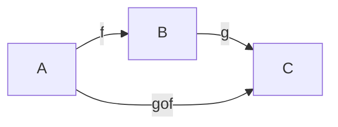
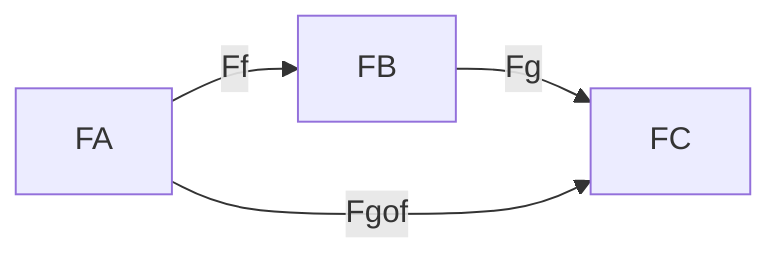
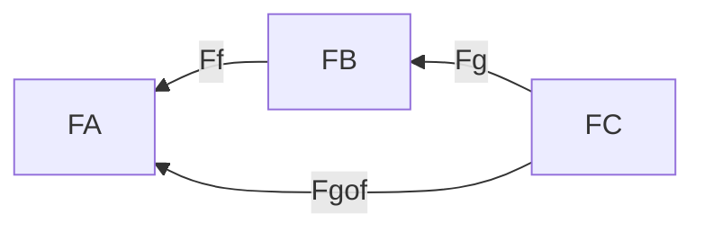

Práctica 5:
1-4, 5a, 6-8, 10

---

Una subcategoría S de una categoría C está dada por
- una subcolección de objetos de C, ob(S)
- una subcolección de flechas de C, fl(S)
tales que
- $\forall x \in ob(S): id_x \in fl(S)$
- $\forall f \in fl(S): dom(f), codom(f) \in ob(S)$
- $f,g \in fl(S) \implies f\circ g \in fl(S)$ (si está definida)

Una subcategoría S de una categoría C es completa si $\forall x,y \in ob(S):
fl_S(x,y) = fl_C(x,y)$

Ejemplos
- Set es sugcategoría de Rel (no completa)
- Pos es subcategoría de Pre (completa)
- Gr es subcategoría de Mon (completa)

---

Un functor de C a D es una doble asignación:
- Ob C -> Ob D
- Fl C -> Fl D

Notación:

- $A \in ob(C) \implies F(A) \in ob(D)$
- $f \in mor(C) \implies F(f) \in mor(D)$

Se deben satisfacer:
- $F(id_A) = id_{F(A)}$
- Respetar composiciones

F Covariante:

F Contravariante:

Si $A \xrightarrow f B$
Queremos una relación en D entre F(A), F(B) y F(f) que puede ser:
- F Covariante
    - $F(A) \xrightarrow {F(f)} F(B)$
    - $F(g \circ f) = F(g) \circ F(f)$
- F Contracovariante
    - $F(A) \xleftarrow {F(f)} F(B)$
    - $F(g \circ f) = F(f) \circ F(g)$

--- 
- Functor F completo: sobreyectiva para flechas
- Functor F confiable: inyectiva para flechas

---

# 1. Sean C y D dos categor ́ıas.  Probar que P1:C×D → C tal que P1(C,D) = C y P2:C×D → D tal que P2(C,D) =D definen functores

## P1:

Veamos que pasa con los morfismos de CxD
- $P_1((c_1, d_1) \circ (c_2, d_2))$
    - = Def de composición en CxD
    - $ P_1(c_1 \circ c_2, d_1 \circ d_2)$ 
    - = Def P_1 
    - $c_1 \circ c_2$
    - = Def P_1 
    - $ P_1(c_1, d_1) \circ P_1(c_2, d_2)$ 

- $P_1(id_{(c, d)}) = P_1(id_c, id_d) =  id_c = id_{P_1(c, d)}$

## P2:

Veamos que pasa con los morfismos de CxD
- $P_2((c_1, d_1) \circ (c_2, d_2))$
    - = Def de composición en CxD
    - $ P_2(c_1 \circ c_2, d_1 \circ d_2)$ 
    - = Def P_2
    - $d_1 \circ d_2$
    - = Def P_2 
    - $ P_2(c_1, d_1) \circ P_2(c_2, d_2)$ 

- $P_2(id_{(c, d)}) = P_2(id_c, id_d) =  id_d = id_{P_2(c, d)}$

# 2.Dado un conjunto X, definimos el conjunto List(X) de las listas finitas de elementos de X. Probar que List :Set→Set es un funtor.  Considerando ahora List(X) como un monoide, probar que List :Set→Mon es un funtor.  Determinar si List preserva productos.Ayuda:pensar en cu ́al monoide es isomorfoList(X) cuandoXes un conjunto con un solo elemento.

TODO
- def List de morfismo

dem
- $List(id_A) [a_1, a_2 ... a_n]$ 
    - = def List de morfismo 
    - $[id_A(a_1) ... id_A(a_n)] 
    - = def id_A
    - $[a_1, a_2 ... a_n] 
    - = def id Set
    - $id_{List(A)} [a_1, a_2 ... a_n]$
- $List(f \circ g) [a_1 ... a_n]$
    - = def List de morfismo
    - $[(f \circ g) (a_1) ... (f \circ g) (a_n)]$
    - = def composición
    - $[f ( (g (a_1))) ... f ((g (a_n)))]$
    - = def List de morfismo
    - $List(f) [g(a_1) ... g(a_n)]$
    - = def List de morfismo
    - $List(f) (List(g) [a_1 ... a_n])$
    - = def composición
    - $List(f) \circ List(g) [a_1 ... a_n]$

# 3.Se ha visto que puede considerarse a un monoide como una categor ́ıa con un  ́unico objeto, ¿qu ́e es unfuntor entre dos categor ́ıas de este tipo?  ¿Y entre categor ́ıas formadas a partir de conjuntos ordenados?

Los functores entre monoides vistos como categorías tienen que mapear el único objeto * de cada monoide

Llamemos M y N a los monoides

$F(*_M) = *_N$

Práctica 5:
1-4, 5a, 6-8, 10
