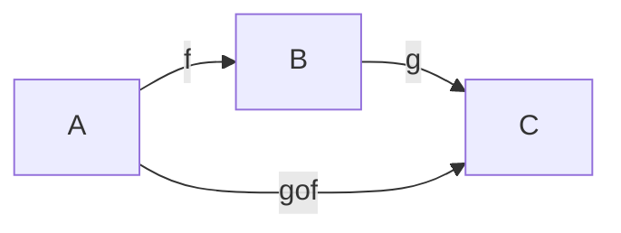
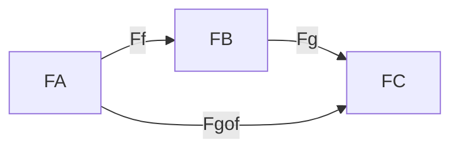
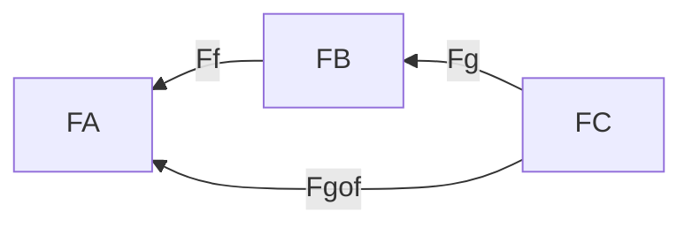

Práctica 5:
1-4, 5a, 6-8, 10

---

Una subcategoría S de una categoría C está dada por
- una subcolección de objetos de C, ob(S)
- una subcolección de flechas de C, fl(S)
tales que
- $\forall x \in ob(S), 1.x \in fl(S)$
- $\forall f \in fl(S) dom(f), codom(f) \in ob(S)$
- $\forall f,g \in fl(S) \implies f.g \in fl(S) (si está definida)$

Una subcategoría S de una categoría C es completa si $\forall x,y \in ob(S)
flS(x,y) = flC(x,y)$

Ejemplos
- Set es sugcategoría de Rel (no completa)
- Pos es subcategoría de Pre (completa)
- Gr es subcategoría de Mon (completa)

---

Un functor de C a D es una doble asignación:
- Ob C -> Ob D
- Fl C -> Fl D

Notación:

- $A \in ob(C) \implies F(A) \in ob(D)$
- $f \in mor(C) \implies F(f) \in mor(D)$

Se deben satisfacer:
- $F(id_A) = id_{F(A)}$
- Respetar composiciones

F Covariante:

F Contracovariante:

Si $A \xrightarrow f B$
Queremos una relación en D entre F(A), F(B) y F(f) que puede ser:
- F Covariante
    - $F(A) \xrightarrow {F(f)} F(B)$
    - $F(g \circ f) = F(g) \circ F(f)$
- F Contracovariante
    - $F(A) \xleftarrow {F(f)} F(B)$
    - $F(g \circ f) = F(f) \circ F(g)$

Functor F completo: sobreyectiva para flechas
Functor F confiable: inyectiva para flechas

---

# 1. Sean C y D dos categor ́ıas.  Probar que P1:C×D → C tal que P1(C,D) = C y P2:C×D → D tal que P2(C,D) =D definen functores

## P1:

Veamos que pasa con los morfismos de CxD
- $P_1((c_1, d_1) \circ (c_2, d_2))$
    - = Def de composición en CxD
    - $ P_1(c_1 \circ c_2, d_1 \circ d_2)$ 
    - = Def P_1 
    - $c_1 \circ c_2$
    - = Def P_1 
    - $ P_1(c_1, d_1) \circ P_1(c_2, d_2)$ 

- $P_1(id_{(c, d)}) = P_1(id_c, id_d) =  id_c = id_{P_1(c, d)}$
