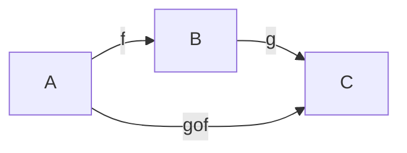
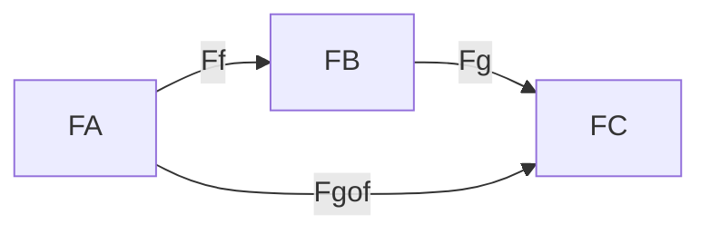
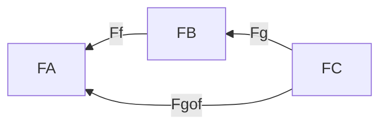

Práctica 5:
1-4, 5a, 6-8, 10

---

Una subcategoría S de una categoría C está dada por
- una subcolección de objetos de C, ob(S)
- una subcolección de flechas de C, fl(S)
tales que
- $\forall x \in ob(S): id_x \in fl(S)$
- $\forall f \in fl(S): dom(f), codom(f) \in ob(S)$
- $f,g \in fl(S) \implies f\circ g \in fl(S)$ (si está definida)

Una subcategoría S de una categoría C es completa si $\forall x,y \in ob(S):
fl_S(x,y) = fl_C(x,y)$

Ejemplos
- Set es sugcategoría de Rel (no completa)
- Pos es subcategoría de Pre (completa)
- Gr es subcategoría de Mon (completa)

---

Un functor de C a D es una doble asignación:
- Ob C -> Ob D
- Fl C -> Fl D

Notación:

- $A \in ob(C) \implies F(A) \in ob(D)$
- $f \in mor(C) \implies F(f) \in mor(D)$

Se deben satisfacer:
- $F(id_A) = id_{F(A)}$
- Respetar composiciones

F Covariante:

F Contravariante:

Si $A \xrightarrow f B$
Queremos una relación en D entre F(A), F(B) y F(f) que puede ser:
- F Covariante
    - $F(A) \xrightarrow {F(f)} F(B)$
    - $F(g \circ f) = F(g) \circ F(f)$
- F Contracovariante
    - $F(A) \xleftarrow {F(f)} F(B)$
    - $F(g \circ f) = F(f) \circ F(g)$

--- 
- Functor F completo: sobreyectiva para flechas
- Functor F confiable: inyectiva para flechas

---

# 1. Sean C y D dos categor ́ıas.  Probar que P1:C×D → C tal que P1(C,D) = C y P2:C×D → D tal que P2(C,D) =D definen functores

## P1:

Veamos que pasa con los morfismos de CxD
- $P_1(id_{(c, d)}) = P_1(id_c, id_d) =  id_c = id_{P_1(c, d)}$
- $P_1((c_1, d_1) \circ (c_2, d_2))$
    - = Def de composición en CxD
    - $ P_1(c_1 \circ c_2, d_1 \circ d_2)$ 
    - = Def P_1 
    - $c_1 \circ c_2$
    - = Def P_1 
    - $ P_1(c_1, d_1) \circ P_1(c_2, d_2)$ 

## P2:

Veamos que pasa con los morfismos de CxD
- $P_2((c_1, d_1) \circ (c_2, d_2))$
    - = Def de composición en CxD
    - $ P_2(c_1 \circ c_2, d_1 \circ d_2)$ 
    - = Def P_2
    - $d_1 \circ d_2$
    - = Def P_2 
    - $ P_2(c_1, d_1) \circ P_2(c_2, d_2)$ 

- $P_2(id_{(c, d)}) = P_2(id_c, id_d) =  id_d = id_{P_2(c, d)}$

# 2.Dado un conjunto X, definimos el conjunto List(X) de las listas finitas de elementos de X. Probar que List :Set→Set es un funtor.  Considerando ahora List(X) como un monoide, probar que List :Set→Mon es un funtor.  Determinar si List preserva productos.Ayuda:pensar en cu ́al monoide es isomorfoList(X) cuandoXes un conjunto con un solo elemento.

Sabemos como List se comporta sobre los objetos de Set
$$ List(X) = \{[x_1, x_2 ... x_n] : x_i \in X\} $$

Ahora tenemos que ver cómo se deberá comportar List con los morfismos de Set para que sea un functor. La manera más intuitiva que se me ocurre es hacer un mapeo de los elementos de la listas

$$List(f:A \rightarrow B):List(A)\rightarrow List(B) : List(f)([a_1, a_2 ... a_n]) = [f(a_1), f(a_2) ... f(a_n)] $$

Veamos que List cumple las propiedades para ser functor
- $List(id_A) [a_1, a_2 ... a_n]$ 
    - = def List de morfismo 
    - $[id_A(a_1) ... id_A(a_n)]$
    - = def id_A
    - $[a_1, a_2 ... a_n] $
    - = def id de conjuntos
    - $id_{List(A)} [a_1, a_2 ... a_n]$
- $List(f \circ g) [a_1 ... a_n]$
    - = def List de morfismo
    - $[(f \circ g) (a_1) ... (f \circ g) (a_n)]$
    - = def composición
    - $[f ( g (a_1)) ... f (g (a_n))]$
    - = def List de morfismo
    - $List(f) [g(a_1) ... g(a_n)]$
    - = def List de morfismo
    - $List(f) (List(g) [a_1 ... a_n])$
    - = def composición
    - $List(f) \circ List(g) [a_1 ... a_n]$

TODO: Para el caso de list como monoide, ver que las flechas en las que caemos son morfismos de monoides, es decir, preserve el elemento neutro y el producto

# 3. Se ha visto que puede considerarse a un monoide como una categor ́ıa con un  ́unico objeto, ¿qu ́e es unfuntor entre dos categor ́ıas de este tipo?  ¿Y entre categor ́ıas formadas a partir de conjuntos ordenados?

---

Los functores entre monoides vistos como categorías lo único que pueden mapear es el único objeto * de cada monoide

Llamemos M y N a los monoides

$F(*_M) = *_N$

Además, tiene que mapear las flechas. Particularmente la identidad tiene que ser mapeada por def de funtor como:

$F(id_{*_M}) = id_{F(*_M)} = id_{*_N}$

Y si recordamos que la identidad en el monoide visto como categoría es el elemento neutro, obtenemos:

$F(e_M) = e_N$

Además tenemos que preservar la estructura de composición

F covariante:
- $F(a \circ b) = F(a) \circ F(b)$
- $\iff$ monoide visto como categoría
- $F(ab) = F(a) F(b)$

F contravariante:
- $F(a \circ b) = F(b) \circ F(a)$
- $\iff$ monoide visto como categoría
- $F(ab) = F(b) F(a)$
- $F(b \cdot _{op} a) = F(b) F(a)$
- $F(ab) =  F(a) \cdot _{op} F(b)$

¡Hemos redescubierto la definición de morfismo de monoides!

Los funtores covariantes son los morfismos entre monoides y los contravariantes son los morfismos entre un monoide y el monoide op del otro (o viceversa)

---

Los functores entre conjuntos ordenados vistos como categorías tienen que cumplir

- $F(id_x) = id_F(x)$
- $F(f \circ g) = F(f) \circ F(g)$ (covariante)
- $F(f \circ g) = F(g) \circ F(f)$ (contravariante)

# TODO

---

# 4. Dados dos funtores F:C → D y G:D → E, definir un funtor que componga ambos.  ¿Es posible definir una categor ́ıa cuyos objetos sean las categor ́ıas y sus flechas sean los funtores entre estas?

- $ F(id_C) = id_{F(C)}$
- $ F(f_C \circ g_C) = F(f_C) \circ F(g_C)$
- $ G(id_D) = id_{F(D)}$
- $ G(f_D \circ g_D) = G(f_D) \circ G(g_D)$

Buscamos un H:C->E tal que
- $ H(id_C) = id_{H(C)}$
- $ H(f_C \circ g_C) = H(f_C) \circ H(g_C)$

Definimos a H como la composición de G con F
- $ H(id_C) = G \circ F (id_C) = G (F (id_C)) = G (id_{F(C)}) = id_{G(F(C))} = id_{G \circ F(C)} = id_{H(C)}$
- $ H(f_C \circ g_C) = G \circ F(f_C \circ g_C) = G (F (f_C \circ g_C)) = G (F (f_C) \circ F (g_C)) = G (F (f_C)) \circ G (F (g_C)) = H(f_C) \circ H(g_C)$

Podemos definir CAT como la categoría de categorías pequeñas. Notemos que CAT no es una categoría pequeña, porque sino sufriría de la paradoja de Russell.

CAT nos queda bien definida ya que tenemos el funtor identidad y acabamos de mostrar que los podemos componer (y es asociativa porque estamos trabajando con categorías pequeñas).
--- 

# 5. Sea C una  categor ́ıa  con  productos,  coproductos  y  exponenciales  y A∈ob(C).   Probar  que  las siguientes aplicaciones pueden extenderse con estructura funtorial:

## a)∆ :C →C×Ctal que ∆(B) = (B,B). 

Id
- $\Delta (id_C)$ 
- = def 
- $(id_C, id_C)$ 
- = id en CxC
- $id_{(C , C)} $
- = def
- $id_{\Delta (C)}$

Composición
- $\Delta (f \circ g)$ 
- = def
- $(f \circ g, f \circ g)$ 
- = composición en CxC
- $(f, f) \circ (g, g)$ 
- = def
- $\Delta f \circ \Delta g$

# 6. Sea C una categor ́ıa localmente peque ̃na, para cada objeto X de C definimos Hom(X,−) :C →Set donde Hom(X,−)(Y)  =Hom(X,Y)  y Hom(X,−)(f) =Hom(X,f)  =λg.f◦g.   Probar  queHom(X,−)  esefectivamente un funtor para cadaX.  Definir an ́alogamente un funtorHom(−,X).

TODO: Preguntar: g:X -> dom(f)?

Veamos que cumple las propiedades de funtor. Tomemos un objeto X arbitrario:

Identidad:
- $Hom(X,-)(id_C)$
- = def
- $Hom(X,id_C)$
- = def
- $λg.id_C \circ g$ (codom g = C)
- = id neutra respecto a la composición
- $λg. g$ 
- = def id + def Hom
- $id_{Hom(X, C)}$
- = def
- $id_{Hom(X,-) (C)}$

Composición:
- $Hom(X,-)(f \circ h)$
- = def
- $Hom(X,f \circ h)$
- = def
- $λg.(f \circ h) \circ g$
- = asociatividad de los morfismos de categorías
- $λg.f \circ (h \circ g)$
- = composición de lambda calculo
- $(λg.f \circ g) \circ (λg.h \circ g)$
- = def
- $Hom(X,f) \circ Hom(X,h)$
- = def
- $Hom(X,-)(f) \circ Hom(X,-)(h)$

---

Definimos 

- $Hom(-, Y) (X) = Hom(X, Y)$
- $Hom(-, Y) (f) (g) = Hom(f, Y) (g) = g \circ f$ 

Identidad:
- $Hom(-, Y) (id_C) (g)$
- = def
- $Hom(id_C, Y) (g)$
- = def
- $g \circ id_C$ (dom g = C)
- = id neutra respecto a la composición
- $g$ 
- = def 
- $id_{Hom(C, Y)} (g)$
- = def
- $id_{Hom(-, Y) (C)} (g)$

Composición:
- $Hom(-, Y) (f \circ h) (g)$
- = def
- $Hom(f \circ h, Y) (g)$
- = def
- $g \circ (f \circ h)$
- = asociatividad de los morfismos de categorías
- $(g \circ f) \circ h$
- = def
- $Hom(h, Y) \circ (g \circ f)$
- = def
- $Hom(h, Y) (Hom(f, Y) (g))$
- = def
- $(Hom(h, Y) \circ Hom(f, Y)) (g)$
- = def composición
- $(Hom(-, Y)(h) \circ Hom(-, Y)(f)) (g)$

# 7. Si f:A→B en Set, entonces definimos f−1(X) ={a∈A:f(a)∈X} dondeX⊂B.  Probar que I:Set→Set es un funtor contravariante, llevandoI(A) =P(A) y I(f) =f−1.

Identidad:
- $I(id_C)$
- = def
- $id_C^{-1}$
- = def
- $\lambda X. \{ a \in C : id_C(a) \in X \}$ con ($X \sub C$)
- = def id_C
- $\lambda X. \{ a \in C : a \in X \}$
- = como $X \sub C$
- $\lambda X. \{ a \in X \}$ 
- = como $X \sub C$
- $id_{\mathcal{P} (C)}$
- = def
- $id_{I(C)}$

Composición: sea g:A→B y f:B→C.
- $I(f \circ g)$
- = def
- = $(f \circ g)^{-1}$
- = def
- = $\lambda X. \{ a \in A : f \circ g(a) \in X \}$ con ($X \sub C$)
- = composición?
- = $\lambda Y. \{ b \in B: f (b) \in Y \} \circ \lambda X. \{ a \in A : g(a) \in X \}$ con ($Y \sub C$ y $X \sub B$)
- = def
- $I(f) \circ I(g)$

Composición: sea g:A→B y f:B→C.
- $I(f \circ g) (X)$
- = def
- = $(f \circ g)^{-1} (X)$
- = def
- = $\{ a \in A : f \circ g(a) \in X \}$
- = composición?
- = $\lambda Y. \{ b \in B: f (b) \in Y \} \circ \{ a \in A : g(a) \in X \}$
- = 
- = $\lambda Y. \{ b \in B: f (b) \in Y \} \circ \lambda Z. \{ a \in A : g(a) \in Z \} (X)$
- = def
- $I(f) \circ I(g) (X)$

# 8.Dado un semigrupo (S,.) , podemos construir un monoide (S′,.′) dondeS′=S]{e},(0,x).′(0,y)  =  (0,x.y),  y  (1,e).′x=x=x.′(1,e).   Utilizando  esta  construcci ́on,  definir  un  funtorF:Sem→Mony probar que es un monomorfismo enCat.

F()

---
Práctica 5:
1-4, 5a, 6-8, 10
