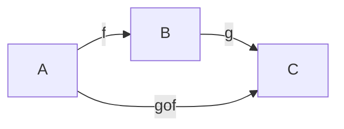
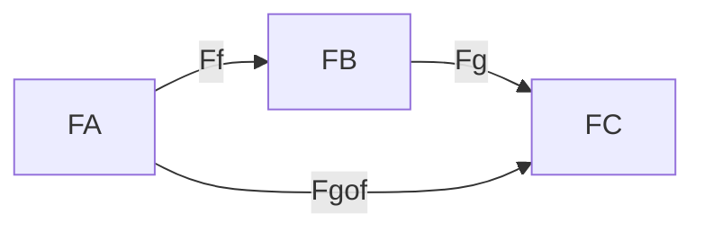
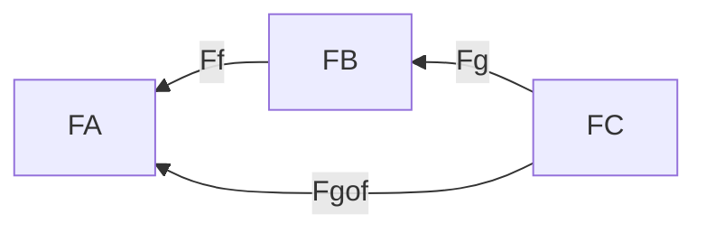

Práctica 5:
1-4, 5a, 6-8, 10

---

Una subcategoría S de una categoría C está dada por
- una subcolección de objetos de C, ob(S)
- una subcolección de flechas de C, fl(S)
tales que
- $\forall x \in ob(S): id_x \in fl(S)$
- $\forall f \in fl(S): dom(f), codom(f) \in ob(S)$
- $f,g \in fl(S) \implies f\circ g \in fl(S)$ (si está definida)

Una subcategoría S de una categoría C es completa si $\forall x,y \in ob(S):
fl_S(x,y) = fl_C(x,y)$

Ejemplos
- Set es sugcategoría de Rel (no completa)
- Pos es subcategoría de Pre (completa)
- Gr es subcategoría de Mon (completa)

---

Un functor de C a D es una doble asignación:
- Ob C -> Ob D
- Fl C -> Fl D

Notación:

- $A \in ob(C) \implies F(A) \in ob(D)$
- $f \in mor(C) \implies F(f) \in mor(D)$

Se deben satisfacer:
- $F(id_A) = id_{F(A)}$
- Respetar composiciones

F Covariante:

F Contravariante:

Si $A \xrightarrow f B$
Queremos una relación en D entre F(A), F(B) y F(f) que puede ser:
- F Covariante
    - $F(A) \xrightarrow {F(f)} F(B)$
    - $F(g \circ f) = F(g) \circ F(f)$
- F Contracovariante
    - $F(A) \xleftarrow {F(f)} F(B)$
    - $F(g \circ f) = F(f) \circ F(g)$

--- 
- Functor F completo: sobreyectiva para flechas
- Functor F confiable: inyectiva para flechas

---

# 1. Sean C y D dos categor ́ıas.  Probar que P1:C×D → C tal que P1(C,D) = C y P2:C×D → D tal que P2(C,D) =D definen functores

## P1:

Veamos que pasa con los morfismos de CxD
- $P_1(id_{(c, d)}) = P_1(id_c, id_d) =  id_c = id_{P_1(c, d)}$
- $P_1((c_1, d_1) \circ (c_2, d_2))$
    - = Def de composición en CxD
    - $ P_1(c_1 \circ c_2, d_1 \circ d_2)$ 
    - = Def P_1 
    - $c_1 \circ c_2$
    - = Def P_1 
    - $ P_1(c_1, d_1) \circ P_1(c_2, d_2)$ 

## P2:

Veamos que pasa con los morfismos de CxD
- $P_2((c_1, d_1) \circ (c_2, d_2))$
    - = Def de composición en CxD
    - $ P_2(c_1 \circ c_2, d_1 \circ d_2)$ 
    - = Def P_2
    - $d_1 \circ d_2$
    - = Def P_2 
    - $ P_2(c_1, d_1) \circ P_2(c_2, d_2)$ 

- $P_2(id_{(c, d)}) = P_2(id_c, id_d) =  id_d = id_{P_2(c, d)}$

# 2.Dado un conjunto X, definimos el conjunto List(X) de las listas finitas de elementos de X. Probar que List :Set→Set es un funtor.  Considerando ahora List(X) como un monoide, probar que List :Set→Mon es un funtor.  Determinar si List preserva productos.Ayuda:pensar en cu ́al monoide es isomorfoList(X) cuandoXes un conjunto con un solo elemento.

Sabemos como List se comporta sobre los objetos de Set
$$ List(X) = \{[x_1, x_2 ... x_n] : x_i \in X\} $$

Ahora tenemos que ver cómo se deberá comportar List con los morfismos de Set para que sea un functor. La manera más intuitiva que se me ocurre es hacer un mapeo de los elementos de la listas

$$List(f:A \rightarrow B):List(A)\rightarrow List(B) : List(f)([a_1, a_2 ... a_n]) = [f(a_1), f(a_2) ... f(a_n)] $$

Veamos que List cumple las propiedades para ser functor
- $List(id_A) [a_1, a_2 ... a_n]$ 
    - = def List de morfismo 
    - $[id_A(a_1) ... id_A(a_n)]$
    - = def id_A
    - $[a_1, a_2 ... a_n] $
    - = def id de conjuntos
    - $id_{List(A)} [a_1, a_2 ... a_n]$
- $List(f \circ g) [a_1 ... a_n]$
    - = def List de morfismo
    - $[(f \circ g) (a_1) ... (f \circ g) (a_n)]$
    - = def composición
    - $[f ( g (a_1)) ... f (g (a_n))]$
    - = def List de morfismo
    - $List(f) [g(a_1) ... g(a_n)]$
    - = def List de morfismo
    - $List(f) (List(g) [a_1 ... a_n])$
    - = def composición
    - $List(f) \circ List(g) [a_1 ... a_n]$

TODO: Para el caso de list como monoide, ver que las flechas en las que caemos son morfismos de monoides, es decir, preserve el elemento neutro y el producto

# 3. Se ha visto que puede considerarse a un monoide como una categor ́ıa con un  ́unico objeto, ¿qu ́e es unfuntor entre dos categor ́ıas de este tipo?  ¿Y entre categor ́ıas formadas a partir de conjuntos ordenados?

---

Los functores entre monoides vistos como categorías lo único que pueden mapear es el único objeto * de cada monoide

Llamemos M y N a los monoides

$F(*_M) = *_N$

Además, tiene que mapear las flechas. Particularmente la identidad tiene que ser mapeada por def de funtor como:

$F(id_{*_M}) = id_{F(*_M)} = id_{*_N}$

Y si recordamos que la identidad en el monoide visto como categoría es el elemento neutro, obtenemos:

$F(e_M) = e_N$

Además tenemos que preservar la estructura de composición

F covariante:
- $F(a \circ b) = F(a) \circ F(b)$
- $\iff$ monoide visto como categoría
- $F(ab) = F(a) F(b)$

F contravariante:
- $F(a \circ b) = F(b) \circ F(a)$
- $\iff$ monoide visto como categoría
- $F(ab) = F(b) F(a)$
- $F(b \cdot _{op} a) = F(b) F(a)$
- $F(ab) =  F(a) \cdot _{op} F(b)$

¡Hemos redescubierto la definición de morfismo de monoides!

Los funtores covariantes son los morfismos entre monoides y los contravariantes son los morfismos entre un monoide y el monoide op del otro (o viceversa)

---

Los functores entre conjuntos ordenados vistos como categorías tienen que cumplir

- $F(id_x) = id_F(x)$
- $F(f \circ g) = F(f) \circ F(g)$ (covariante)
- $F(f \circ g) = F(g) \circ F(f)$ (contravariante)

# TODO

---

# 4. Dados dos funtores F:C → D y G:D → E, definir un funtor que componga ambos.  ¿Es posible definir una categor ́ıa cuyos objetos sean las categor ́ıas y sus flechas sean los funtores entre estas?

- $ F(id_C) = id_{F(C)}$
- $ F(f_C \circ g_C) = F(f_C) \circ F(g_C)$
- $ G(id_D) = id_{F(D)}$
- $ G(f_D \circ g_D) = G(f_D) \circ G(g_D)$

Buscamos un H:C->E tal que
- $ H(id_C) = id_{H(C)}$
- $ H(f_C \circ g_C) = H(f_C) \circ H(g_C)$

Definimos a H como la composición de G con F
- $ H(id_C) = G \circ F (id_C) = G (F (id_C)) = G (id_{F(C)}) = id_{G(F(C))} = id_{G \circ F(C)} = id_{H(C)}$
- $ H(f_C \circ g_C) = G \circ F(f_C \circ g_C) = G (F (f_C \circ g_C)) = G (F (f_C) \circ F (g_C)) = G (F (f_C)) \circ G (F (g_C)) = H(f_C) \circ H(g_C)$

Veamos que la composición de funtores es asociativa
F G H

F o (G o H) =?= (F o G) o H

F o (G o H) (A) = 
F ((G o H) (A)) = 
F (G(H(A))) =
(F o G) (H  (A)) =
(F o G) o H (A)

Podemos definir CAT como la categoría de categorías pequeñas. 

CAT nos queda bien definida ya que tenemos el funtor identidad y acabamos de mostrar que los podemos componer.

Notemos que CAT contiene a todos los conjuntos (vistos como categorías discretas), y por lo tanto no es una categoría pequeña, porque sino sería una paradoja (conjunto de todos los conjuntos).
--- 

# 5. Sea C una  categor ́ıa  con  productos,  coproductos  y  exponenciales  y A∈ob(C).   Probar  que  las siguientes aplicaciones pueden extenderse con estructura funtorial:

## a)∆ :C →C×Ctal que ∆(B) = (B,B). 

Id
- $\Delta (id_C)$ 
- = def 
- $(id_C, id_C)$ 
- = id en CxC
- $id_{(C , C)} $
- = def
- $id_{\Delta (C)}$

Composición
- $\Delta (f \circ g)$ 
- = def
- $(f \circ g, f \circ g)$ 
- = composición en CxC
- $(f, f) \circ (g, g)$ 
- = def
- $\Delta f \circ \Delta g$

# 6. Sea C una categor ́ıa localmente peque ̃na, para cada objeto X de C definimos Hom(X,−) :C →Set donde Hom(X,−)(Y)  =Hom(X,Y)  y Hom(X,−)(f) =Hom(X,f)  =λg.f◦g.   Probar  queHom(X,−)  esefectivamente un funtor para cadaX.  Definir an ́alogamente un funtorHom(−,X).

TODO: Preguntar: g:X -> dom(f)?

Veamos que cumple las propiedades de funtor. Tomemos un objeto X arbitrario:

Identidad:
- $Hom(X,-)(id_C)$
- = def
- $Hom(X,id_C)$
- = def
- $λg.id_C \circ g$ (codom g = C)
- = id neutra respecto a la composición
- $λg. g$ 
- = def id + def Hom
- $id_{Hom(X, C)}$
- = def
- $id_{Hom(X,-) (C)}$

Composición:
- $Hom(X,-)(f \circ h)$
- = def
- $Hom(X,f \circ h)$
- = def
- $λg.(f \circ h) \circ g$
- = asociatividad de los morfismos de categorías
- $λg.f \circ (h \circ g)$
- = composición de lambda calculo
- $(λg.f \circ g) \circ (λg.h \circ g)$
- = def
- $Hom(X,f) \circ Hom(X,h)$
- = def
- $Hom(X,-)(f) \circ Hom(X,-)(h)$

---

Definimos 

- $Hom(-, Y) (X) = Hom(X, Y)$
- $Hom(-, Y) (f) (g) = Hom(f, Y) (g) = g \circ f$ 

Identidad:
- $Hom(-, Y) (id_C) (g)$
- = def
- $Hom(id_C, Y) (g)$
- = def
- $g \circ id_C$ (dom g = C)
- = id neutra respecto a la composición
- $g$ 
- = def 
- $id_{Hom(C, Y)} (g)$
- = def
- $id_{Hom(-, Y) (C)} (g)$

Composición:
- $Hom(-, Y) (f \circ h) (g)$
- = def
- $Hom(f \circ h, Y) (g)$
- = def
- $g \circ (f \circ h)$
- = asociatividad de los morfismos de categorías
- $(g \circ f) \circ h$
- = def
- $Hom(h, Y) \circ (g \circ f)$
- = def
- $Hom(h, Y) (Hom(f, Y) (g))$
- = def
- $(Hom(h, Y) \circ Hom(f, Y)) (g)$
- = def composición
- $(Hom(-, Y)(h) \circ Hom(-, Y)(f)) (g)$

# 7. Si f:A→B en Set, entonces definimos f−1(X) ={a∈A:f(a)∈X} dondeX⊂B.  Probar que I:Set→Set es un funtor contravariante, llevandoI(A) =P(A) y I(f) =f−1.

Identidad:
- $I(id_C)$
- = def
- $id_C^{-1}$
- = def
- $\lambda X. \{ a \in C : id_C(a) \in X \}$ con ($X \sub C$)
- = def id_C
- $\lambda X. \{ a \in C : a \in X \}$
- = como $X \sub C$
- $\lambda X. \{ a \in X \}$ 
- = como $X \sub C$
- $id_{\mathcal{P} (C)}$
- = def
- $id_{I(C)}$

Composición: sea g:A→B y f:B→C.
- $I(f \circ g)$
- = def
- = $(f \circ g)^{-1}$
- = def
- = $\lambda X. \{ a \in A : f \circ g(a) \in X \}$ con ($X \sub C$)
- = composición?
- = $\lambda Y. \{ b \in B: f (b) \in Y \} \circ \lambda X. \{ a \in A : g(a) \in X \}$ con ($Y \sub C$ y $X \sub B$)
- = def
- $I(f) \circ I(g)$

Composición: sea g:A→B y f:B→C.
- $I(f \circ g) (X)$
- = def
- $(f \circ g)^{-1} (X)$
- =?= g^{-1} (f^{-1} X)
- Hecho en papel
- = def
- $I(f) \circ I(g) (X)$

# 8.Dado un semigrupo (S,.) , podemos construir un monoide (S′,.′) dondeS′=S]{e},(0,x).′(0,y)  =  (0,x.y),  y  (1,e).′x=x=x.′(1,e).   Utilizando  esta  construcci ́on,  definir  un  funtorF:Sem→Mony probar que es un monomorfismo enCat.

Definimos el comportamiento de F sobre los objetos como la construcción propuesta. Notemos que (1, e) es el elemento neutro del monoide generado.

Ahora definimos el comportamiento de F sobre las flechas de Sem, es decir, los morfismos de semigrupos

- $F(f) (0, x) = (0, f(x))$
- $F(f) (1, e) = (1, e) $

Veamos que F nos manda morfismos de semigrupos en morfismos de monoides

Para el elemento neutro la demostración es trivial por definición.

Para la composición:

Supongamos que tenemos un morfismo de semigrupos f, sabemos que tiene la propiedad de que $f(x.y) = f(x).f(y)$
- $F(f) ((0, x) .' (0, y))$
- = def producto en el monoide construido
- $F(f) (0, x . y)$
- = def F
- $(0, f(x.y))$
- = f morfismo de semigrupos
- $(0, f(x) . f(y))$
- = def de .'
- $(0, f(x)) .' (0, f(y))$
- = def F
- $F(f)(0, x) .' F(f)(0, y)$

---

Veamos que cumple las propiedades de funtor

Id:
- Para elementos de la forma (0, x) 
    - $F(id_C) (0, x)$
    - = def F
    - $(0, id_C(x))$
    - = def id_C (identidad en semigrupos)
    - $(0, x)$
    - = def $id_{F(C)}$ (identidad en monoides)
    - $id_{F(C)} (0, x)$

- Para elementos de la forma (1, e)
    - $F(id_C) (1, e)$
    - = def F
    - $(1, e)$
    - = def $id_{F(C)}$
    - $id_{F(C)} (1, e)$

Composición:
- Para elementos de la forma (0, x) 
    - $F(f \circ g) (0, x)$
    - = def F
    - = $(0, f \circ g(x))$
    - = def composición de morfismos de semi grupos
    - = $(0, f(g(x)))$
    - = def F
    - $F(f) (0, g(x))$
    - = def F
    - $F(f)(F(g) (0, x))$
    - = def composición de morfismos de monoides
    - $(F(f) \circ F(g)) (0, x)$

- Para elementos de la forma (1, e)
    - $F(f \circ g) (1, e)$
    - = def F
    - = $(1, e)$
    - = def F
    - $F(f) (1, e)$
    - = def F
    - $F(f)(F(g) (1, e))$
    - = def composición de morfismos de monoides
    - $(F(f) \circ F(g)) (1, e)$

---

Veamos que F:Sem->Mon es un monomorfismo en Cat

Supongamos que tenemos 2 funtores G:A->Sem y H:A->Sem con A \in Cat tales que $ F \circ G = F \circ H $

Buscamos ver que $G = H$. Para verificar esta igualdad de funtores, lo hacemos por extensión sobre los objetos y los morfismos.
---

f en mor A
F o G (f) = F o H (f)
TODO

---
Veamos que $G(a) = H(a) \forall a \in ob(A)$
- $F o G (a) = F o H (a)$
- $F (G(a)) = F (H(a))$

Partimos de una igualdad de monoides y queremos verificar una igualdad de semigrupos. Nombremos

$(S_G, ._G) = G(a)$

$(S_H, ._H) = H(a)$

$(M_{FG}, ._{FG}, e_{FG}) = F (G(a))$

$(M_{FH}, ._{FH}, e_{FH}) = F (H(a))$

Buscamos que $(S_G, ._G) = (S_H, ._H)$ 

De la hipótesis de que F (G(a)) = F (H(a)) deducimos que las tres componentes del monoide son iguales respectivamente.

---

Veamos que pasa con los conjuntos

$M_{FG} = M_{FH}$ 

$\iff $ def F y $codom G = codom H = Sem$

$\{(0, x): x \in G(a)\} = \{(0, x): x \in H(a)\}$

$\iff$

$\{x \in G(a)\} = \{x \in H(a)\}$

$\iff$

$S_G = S_H$

---

Veamos que pasa con el producto de 2 elementos del monoide. Sean $m,n \in F \circ G (a) = F \circ H (a)$ 

$m ._{FG} n = m ._{FH} n$

$\iff$ def F y $codom G = codom H = Sem \implies m=(0, x), n = (0, y) : x, y \in G(a)=H(a)$

$(0, x) ._{FG} (0, y) = (0, x) ._{FH} (0, y)$

$\iff$ def F

$(0, x ._G y) = (0, x._H y)$

$\iff$

$x ._G y = x._H y$

Y por lo tanto 
$._G = ._H$

---

Entonces, con los 2 resultados anteriores obtenemos que $G(a) = H(a)$ para cualquier $a \in A$ y mostramos que el funtor G y H se comportan igual sobre objetos.

# 10. Sea U:Mon→Set el functor que olvida la estructura de monoide. Definimos adem ́asU2:Mon→Setque en objetos act ́ua llevando (X,⊕,e)7→X×X.  Probar que aU2se lo puede dotar de estructurafunctorial.

$U^2 (X, \oplus, e) = X \times X$

$U^2 (f) (x, y) = (f (x), f(y))$

Notemos que la identidad en monoides es la misma que en conjuntos, una función que a cada elemento le da el mismo elemento.

---
Sea $(X, \oplus, e)$ un monoide:
- $U^2 (id_X) (x, y)$ 
- = def U²
- $(id_X (x), id_X (y))$ 
- = def id de monoide
- $(x, y)$ 
- = def id en XxX
- $id_{X \times X} (x, y)$
- = def U²
- $id_{U^2(X)} (x, y)$

---

Sean f, g morfismos de monoides:

- $U^2(f \circ g) (x, y)$
- = def U²
- $(f \circ g (x), f \circ g (y))$
- = def composición
- $(f (g (x)), f (g (y)))$
- = def U²
- $U^2(f) (g (x), g (y))$
- = def U²
- $U^2(f) ( U^2 (g) (x, y))$
- = def composición
- $U^2(f) \circ U^2 (g) (x, y)$
 

---
Práctica 5:
1-4, 5a, 6-8, 10
